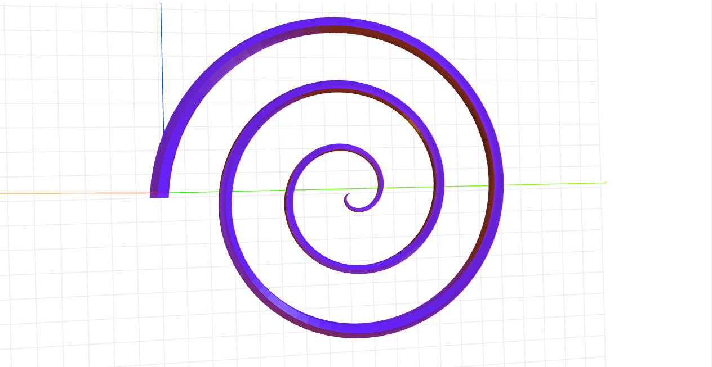

# craft-spiral

#Install
`$npm install craft-spiral`

#Parameters
`numberOfTurns - deetermines how many turns the spiral will make`

#Example
```html
<craft>
	<craft name="spiral" module="craft-spiral"/>
	<spiral numberOfTurns="3"></spiral>
</craft>
```

